# Nexus 新手指南

欢迎使用 Nexus！本指南将引导您完成 Nexus 的安装、部署和基本配置，帮助您快速上手。

## 一、准备工作

在开始之前，请确保您已准备好以下程序：

1. **Nexus 基础包**: 首次使用先下载 [点击此处下载基础包](https://github.com/flvisndn1o223/Nexus/releases/tag/base) 
2. **Nexus 程序**:下载最新程序 Nexus.zip [点击此处下载最新](https://github.com/flvisndn1o223/Nexus/releases/)
    > 解压码:Nexus

3. **将 Nexus.exe 放到基础包运行**
    按照如下目录摆放，Nexus.exe 每次下载最新的
    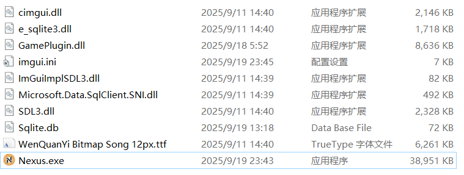

4. **微信 3.9 版本**: [点击此处下载](https://weixin.qq.com/updates?platform=windows&version=3.9.12)

## 二、客户机设置（运行游戏的机器）

客户机是实际运行游戏的计算机。请在每一台客户机上执行以下操作：

### 1. 安装游戏

- 访问 [游戏官网](https://pathofexile2.com/download) 下载并安装游戏
- 安装完成后，请务必**至少启动一次游戏**，看到登录界面后即可关闭

### 2. 安装并配置微信

- 在客户机上安装先前下载的微信 3.9 版本
- 解压缩 Nexus 基础包，找到 `mmcrashpad_client64.dll` 文件
- 将该文件复制到微信的安装目录下，覆盖原有文件。路径为：
  ```
  Tencent\WeChat\[3.9.12.57]\
  ```
    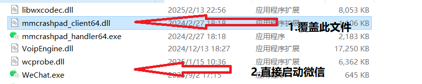


- 启动 `WeChat.exe`，确保微信能够成功运行, 不需要登录。出现登录面板即可

### 3. 部署架构图

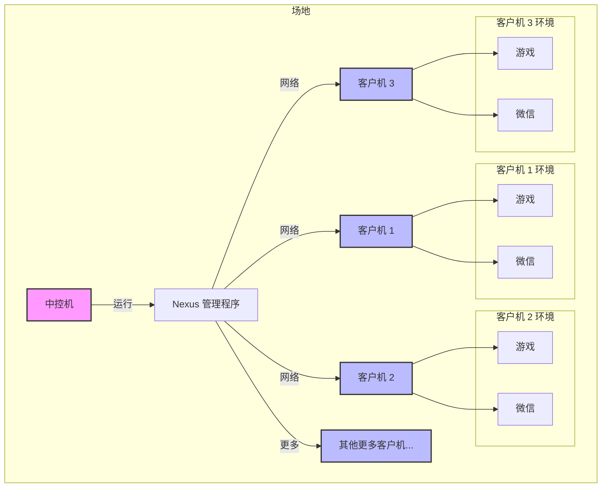

## 三、中控机设置（不运行游戏，仅用于管理）

中控机用于集中管理所有的客户机和任务计划，无需运行游戏。

### 运行 Nexus

- 将解压后的整个 Nexus 文件夹拷贝到中控机
- 直接双击运行 `Nexus.exe` 即可启动中控程序

## 四、使用与配置说明

当中控程序 Nexus 启动后，您将看到管理界面。

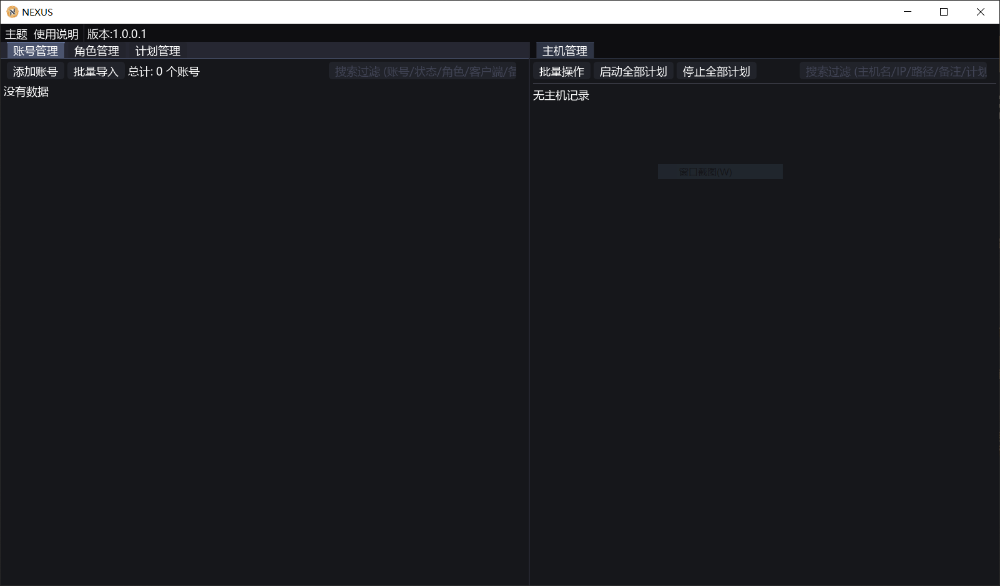

### 1. 添加游戏账号

- 在主界面左侧菜单中找到并点击 **"账号管理"**
- 您可以选择 **"添加账号"** 来逐个输入，或使用 **"批量导入"** 功能快速添加多个账号
- 添加时，仅需填写游戏**账号**和**密码**即可

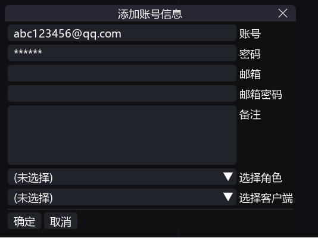

### 2. 创建与管理执行计划

执行计划用于控制在特定时间运行哪个脚本，实现任务自动化（如定时换号、活动任务切换等）。

- 在主界面左侧菜单中点击 **"计划管理"**，然后选择 **"创建计划"**

> **💡 提示**: 系统已内置默认计划，可直接使用或作为参考。

- 为您的计划命名并添加描述，然后在计划列表中选中您刚创建的计划
- 点击 **"添加步骤"** 来为当前计划配置详细流程

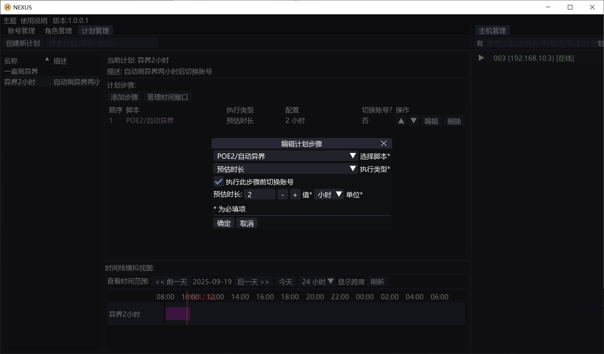

#### 计划步骤配置

在计划步骤中，您需要配置以下选项：

- **使用脚本**：选择需要在此步骤中执行的脚本

- **执行类型**：
  - **直到完成**：脚本会一直运行，直到自身发出完成信号。适用于有明确结束点的任务
  - **预估时长**：为脚本设置一个固定的运行时间（例如 2 小时）。时间一到，程序将自动重启并切换到下一步骤（若设置了切换账号，也会自动切换）。计划会从上至下无限循环所有步骤
  - **窗口时间**：类似日程表，可以精确指定脚本在某个日期或周期性时间段内运行
  - **无限期**：脚本将一直执行，直到手动停止

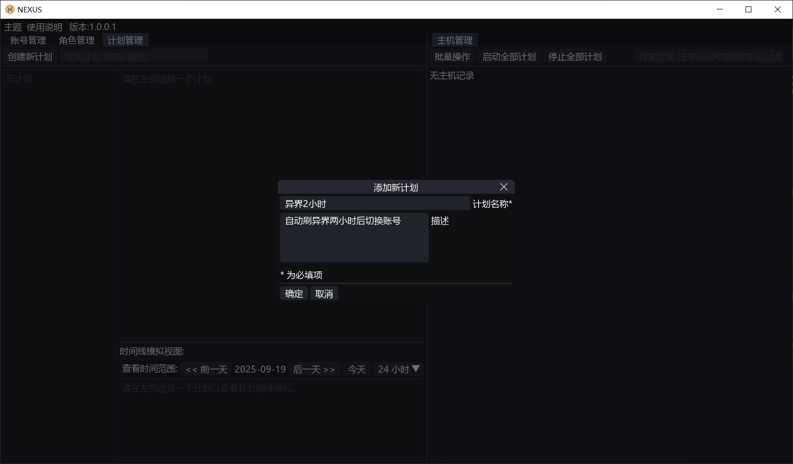

### 3. 绑定与启动客户机

⚠️ **重要**: 确保客户机和中控机位于**同一个局域网**内，配置正确后，您应该能在主界面看到已上线的客户机列表。

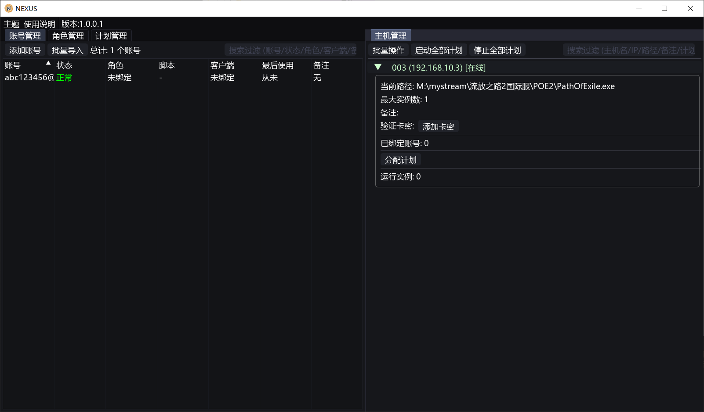

#### 绑定账号到客户机

- 在 **"账号管理"** 列表中，右键点击一个账号，选择要绑定到的客户机
- **绑定目的**：确保该账号只在指定的客户机上登录运行，避免混乱


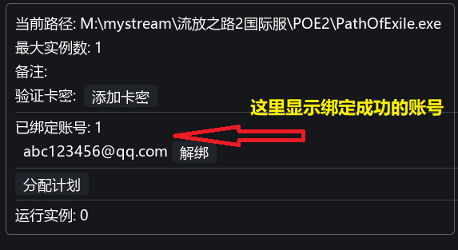

#### 为客户机分配计划

- 在客户机列表中，为每台客户机选择一个先前创建好的执行计划
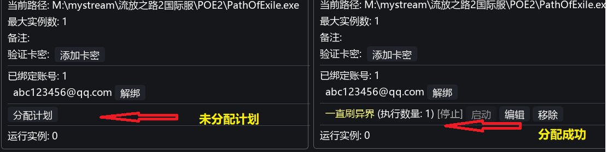

#### 启动任务

- 最后，在系统中设置您的卡密，即可启动客户机，使其按照指定计划自动运行

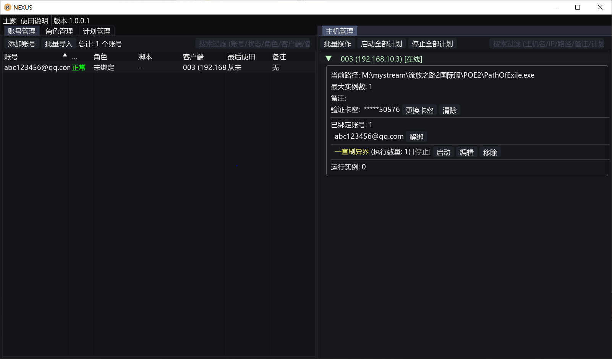


## 五、常见问题

### 角色管理

角色不需要用户手动设置。只要账号能成功登录游戏，角色信息便会自动添加。之后可以在账号设置中选择要使用的角色，重启程序即可生效。

### 多开设置

- Nexus 默认不支持多开，如需多开请自行准备多开软件
- 程序支持多开配置：在 **"批量操作"** 中可以设置总的多开数量上限，同时在每个客户机的配置中可以单独设置该客户机的多开数量。游戏默认可以双开

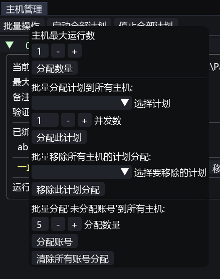

### 游戏路径问题

客户机中的游戏当前路径必须存在，否则启动会失败。如果程序未能自动识别出路径，请手动启动一次游戏，然后再重启微信端程序。

### 验证码

目前还不支持验证码输入，当机器需要输入验证码时请手动完成

---

## 联系支持

如果您有其他问题，请联系我：[Telegram 联系](https://t.me/+NZ_sNo17IUtlYmI1) 👈 ( 需要 VPN 才能访问，如有不清楚的可以淘宝搜索咨询 )

> [Telegram 使用指南](https://github.com/chinavpns/telegram)
[vpn 购买的推荐](https://okyun01.com)
